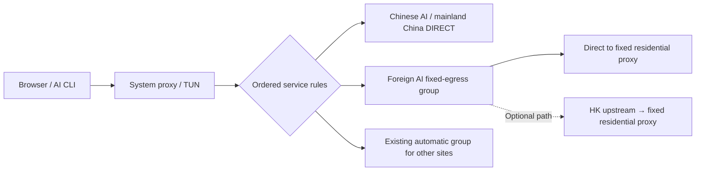

# GoGlobal Infra: Practical Infrastructure Guides and Resources

[Content navigation site](https://ipythoning.github.io/goglobal-infra/) · [中文](README.md) · [English tutorial](docs/tutorial.en.md) · [中文完整教程](docs/tutorial.zh-CN.md)

GoGlobal Infra is a content hub for practical, verifiable infrastructure guides and tools. Its first topic is **AI routing, fixed egress, and DNS privacy across the Clash family**: identify the client and core, configure routing for each service, verify egress and DNS independently, and preserve existing routing and subscription updates for other sites.

The first topic includes computer settings, detailed FlClash steps, independent acceptance checks, and a configuration Skill that different local agents can read. The Skill now covers a Clash-family adaptation workflow while retaining the existing `skills/flclash-ai-privacy/` path and name. **macOS / FlClash 0.8.98** is the only client tested in this repository's case; other clients, cores, and platforms need separate adaptation and validation. The detailed FlClash tutorial preserves the original investigation documented on **2026-10-02 UTC** and does not imply identical features across clients. An IP lookup, a node label, or a third-party score does not establish residential classification, consistent egress for every protocol, or account safety.

## Start here

| Goal | Resource |
| --- | --- |
| Configure your computer and FlClash manually | [Full English tutorial](docs/tutorial.en.md) |
| Work with an agent that has local permissions | [Configuration Skill](skills/flclash-ai-privacy/SKILL.md) |
| Check client and core compatibility | [Compatibility reference](skills/flclash-ai-privacy/references/clash-compatibility.md) |
| Prepare basic domain and mainland routing rules | [Portable policy fragment](skills/flclash-ai-privacy/templates/routing-policy.portable.yaml) |
| Understand inputs and operating boundaries | [Plan schema](skills/flclash-ai-privacy/references/plan-schema.md) · [Agent workflow](skills/flclash-ai-privacy/references/agent-workflow.md) |
| Prepare your own plan | [Placeholder template](skills/flclash-ai-privacy/templates/network-plan.example.json) |

## Adapt to your client

The workflow first checks the actual client, core version, and profile import or override mechanism. The basic template uses inline rules without requiring MRS or `RULE-SET`. It is a fragment with placeholders, cannot be imported as a complete profile, and needs ongoing domain coverage maintenance. Merge it using the client's supported rule and group syntax, then verify which rules match.

The [advanced Mihomo fragment](skills/flclash-ai-privacy/templates/routing-policy.redacted.yaml) and bundled Python helper require the corresponding Mihomo configuration capabilities; do not apply them directly to a legacy Clash core. Check chained dialing, DNS, TUN, and rule-set formats individually in the compatibility reference. A shared workflow does not mean every client supports the same advanced YAML.

## Routing design

The latest redacted case uses the following policy. Its [case reference](skills/flclash-ai-privacy/references/sanitized-network-case.md) records the short probes and their limits.



“Direct to residential proxy” still uses the residential proxy; it omits the HK upstream. The foreign AI group contains no `DIRECT` path and does not fail over to unverified egress; Chinese AI `DIRECT` rules take priority. The HK chain is optional and needs a separate comparison. It does not promise to eliminate jitter.

Other sites use the existing URLTest automatic group. This case selected that group without changing its membership: candidates include both subscription nodes and custom residential nodes, so it is not an airport-only group. Excluding residential candidates needs a separate reviewed change. DNS, WebRTC, and IPv6 also need independent validation; the routing diagram does not establish their behavior.

## Use the Skill

A tool with Skill support can install the entire `skills/flclash-ai-privacy/` directory. An agent without a Skill registry can read its `SKILL.md` and referenced files directly. It still needs the appropriate file, network, and application permissions; a Markdown document does not grant them.

Example task:

> Read `skills/flclash-ai-privacy/SKILL.md` and the compatibility reference in this repository. First identify the Clash-family client and core I explicitly specify, audit only the designated profile and network context, and produce a reviewable patch plan adapted to that client. Preserve other routing and the original subscription. Do not stop the core or TUN or close existing connections. A trusted local runtime must handle credentials without exposing them to the conversation or public repository. After this change is authorized, apply it and independently verify service rules, AI TCP egress, DNS, WebRTC, IPv6, and subscription behavior.

The Python helper targets the Mihomo configuration documented for it. It produces a review by default and writes the source profile only with explicit `--apply`. It does not load a client, control the network core, or automatically implement the new service-routing templates. The Skill handles loading and verification according to the installed client's capabilities.

## What the case established

During the earlier FlClash investigation, two AI TCP paths reached the same fixed egress and the extended DNS test did not show the local ISP's resolvers. A candidate labeled residential exposed WARP, and WebRTC revealed another proxy egress. These are historical observations, not current DNS, WebRTC, or IPv6 validation results for the latest configuration or other clients.

The latest case returned foreign AI traffic to the residential proxy directly, Chinese AI and mainland traffic to `DIRECT`, and other sites to the existing automatic group. Short probes included ordinary requests taking 5–6 seconds; even 30 successful fresh connections do not establish long-term stability. Anonymous HTTP 401/404 responses support connectivity checks, not account status or successful API inference. Fixed egress, residential classification, regional eligibility, and account safety each need their own evidence.

The tutorial retains those limits and shows how to investigate them. It does not alter language, timezone, or fonts to chase a score, and makes no account-safety or zero-disruption promise.

## Sources and related links

Primary configuration references are [FlClash](https://github.com/chen08209/FlClash), [Mihomo](https://wiki.metacubex.one/en/config/), and [ACL4SSR AI rules](https://github.com/ACL4SSR/ACL4SSR/blob/master/Clash/Ruleset/AI.list). Independent checks draw on [DNSLeakTest](https://dnsleaktest.com/), [FuckClaude](https://github.com/LinXiaoTao/FuckClaude), and [check-cc](https://github.com/yacuo/check-cc). Their inclusion does not imply an official joint guarantee.

Repository: [iPythoning/goglobal-infra](https://github.com/iPythoning/goglobal-infra). Related: [shop.paibao.ai](https://shop.paibao.ai).

Public files contain placeholders and general examples, without private subscriptions, proxy credentials, personal public IP addresses, device paths, or exported configurations.

## Maintain the navigation site

`site.json` supplies site metadata, links, dates and article navigation. After changing a Markdown guide, regenerate the static HTML in `docs/`. GitHub Pages serves `/docs` from `main`.

```sh
python3 -m pip install -r requirements.txt
python3 scripts/build_site.py --config site.json
```

This build reads public documents only. Register real content and accurate update dates when adding an article.
