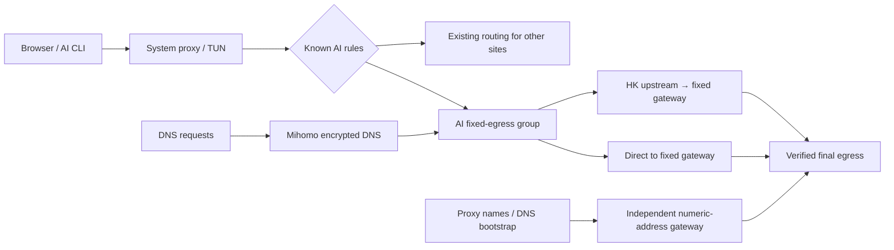

# GoGlobal Infra: Practical Infrastructure Guides and Resources

[Content navigation site](https://ipythoning.github.io/goglobal-infra/) · [中文](README.md) · [English tutorial](docs/tutorial.en.md) · [中文完整教程](docs/tutorial.zh-CN.md)

GoGlobal Infra is a content hub for practical, verifiable infrastructure guides and tools. Its first topic is **AI egress and DNS privacy**: route known AI services through a verified fixed egress, give DNS an explicit encrypted proxy path, and preserve existing routing and subscription updates for other sites.

The first topic includes computer settings, detailed FlClash steps, independent acceptance checks, and a configuration Skill that different local agents can read. It comes from a real **macOS / FlClash 0.8.98** investigation, documented on **2026-10-02 UTC**. Windows and Linux notes link to official sources but were not tested on those platforms in this case. An IP lookup, a node label, or a third-party score does not establish residential classification, consistent egress for every protocol, or account safety.

## Start here

| Goal | Resource |
| --- | --- |
| Configure your computer and FlClash manually | [Full English tutorial](docs/tutorial.en.md) |
| Work with an agent that has local permissions | [Configuration Skill](skills/flclash-ai-privacy/SKILL.md) |
| Understand inputs and operating boundaries | [Plan schema](skills/flclash-ai-privacy/references/plan-schema.md) · [Agent workflow](skills/flclash-ai-privacy/references/agent-workflow.md) |
| Prepare your own plan | [Placeholder template](skills/flclash-ai-privacy/templates/network-plan.example.json) |

## Routing design



“Direct to fixed gateway” still uses a proxy; it omits the HK upstream. The AI group contains no `DIRECT` path and does not fail over to unverified egress. Subscription nodes labeled “residential” are tested separately before admission to the AI group.

## Use the Skill

A tool with Skill support can install the entire `skills/flclash-ai-privacy/` directory. An agent without a Skill registry can read its `SKILL.md` and referenced files directly. It still needs the appropriate file, network, and application permissions; a Markdown document does not grant them.

Example task:

> Read `skills/flclash-ai-privacy/SKILL.md` in this repository. First audit only the FlClash profile and network context I explicitly identify, then produce a reviewable local patch plan. Preserve other routing and the original subscription. Do not stop the core or TUN or close existing connections. A trusted local runtime must handle credentials without exposing them to the conversation or public repository. After this change is authorized, apply it and independently verify AI TCP egress, DNS, WebRTC, IPv6, and subscription behavior.

The Python helper produces a review by default and writes the source profile only with explicit `--apply`. It does not load FlClash or control the network core. The Skill handles loading and verification according to the installed client’s capabilities.

## What the case established

Both AI TCP routes reached the same fixed egress, and the extended DNS test stopped showing the local ISP’s resolvers. However, subscription nodes advertised as residential exposed WARP, WebRTC revealed another proxy egress, and existing long-lived connections were retained for continuity. The case therefore did not establish that every flow used one verified residential address.

The tutorial retains those limits and shows how to investigate them. It does not alter language, timezone, or fonts to chase a score, and makes no account-safety or zero-disruption promise.

## Sources and related links

Primary configuration references are [FlClash](https://github.com/chen08209/FlClash), [Mihomo](https://wiki.metacubex.one/en/config/), and [ACL4SSR AI rules](https://github.com/ACL4SSR/ACL4SSR/blob/master/Clash/Ruleset/AI.list). Independent checks draw on [DNSLeakTest](https://dnsleaktest.com/), [FuckClaude](https://github.com/LinXiaoTao/FuckClaude), and [check-cc](https://github.com/yacuo/check-cc). Their inclusion does not imply an official joint guarantee.

Repository: [iPythoning/goglobal-infra](https://github.com/iPythoning/goglobal-infra). Related: [shop.paibao.ai](https://shop.paibao.ai).

Public files contain placeholders and general examples, without private subscriptions, proxy credentials, personal public IP addresses, device paths, or exported configurations.

## Maintain the navigation site

`site.json` supplies site metadata, links, dates and article navigation. After changing a Markdown guide, regenerate the static HTML in `docs/`. GitHub Pages serves `/docs` from `main`.

```sh
python3 -m pip install -r requirements.txt
python3 scripts/build_site.py --config site.json
```

This build reads public documents only. Register real content and accurate update dates when adding an article.
