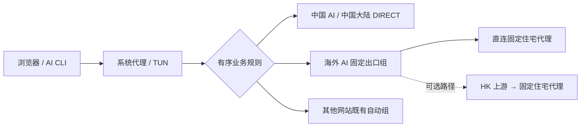

# GoGlobal Infra：出海基础设施与实用内容导航

[内容导航站](https://ipythoning.github.io/goglobal-infra/) · [English](README.en.md) · [从零入门](docs/tutorial.zh-CN.md) · [English guide](docs/tutorial.en.md)

GoGlobal Infra 整理可实践、可核验的出海基础设施内容，作为教程与工具的内容导航。第一组专题是 **Clash 家族的 AI 分流、固定出口与 DNS 隐私**：先识别客户端和内核，再按业务配置路由，独立验证出口与 DNS，同时保留其他网站的分流和订阅更新。

第一组专题包含电脑设置、详细 FlClash 操作、分层验收及可由不同智能体读取的配置 Skill。Skill 已扩展为 Clash 家族的适配工作流，现有 `skills/flclash-ai-privacy/` 路径和名称保留兼容。本仓案例中唯一实测客户端为 macOS / FlClash **0.8.98**；其他客户端、内核和平台需要分别适配与验收。从零教程讲安装、订阅、YAML 和 Skill 交互；[进阶页](docs/advanced-routing.zh-CN.md)保留最初 **2026-10-02 UTC** 的排障过程，不代表所有客户端都有相同功能。一次 IP 查询、节点名称或第三方评分不能证明住宅属性、全流量一致或账号安全。

## 从哪里开始

| 目标 | 入口 |
| --- | --- |
| 第一次使用，先安装并联网 | [从零中文教程](docs/tutorial.zh-CN.md) |
| 已完成入门，排查 DNS/链路 | [Mihomo 进阶与历史案例](docs/advanced-routing.zh-CN.md) |
| 让有本地权限的智能体协助 | [配置 Skill](skills/flclash-ai-privacy/SKILL.md) |
| 确认 Clash 客户端与内核适配范围 | [兼容性说明](skills/flclash-ai-privacy/references/clash-compatibility.md) |
| 准备基础域名与大陆直连规则 | [通用增量模板](skills/flclash-ai-privacy/templates/routing-policy.portable.yaml) |
| 理解修改输入和安全边界 | [输入格式](skills/flclash-ai-privacy/references/plan-schema.md) · [智能体工作流](skills/flclash-ai-privacy/references/agent-workflow.md) |
| 准备自己的配置计划 | [占位符模板](skills/flclash-ai-privacy/templates/network-plan.example.json) |

## 跨客户端适配

工作流先核实实际客户端、内核版本及配置导入、覆写方式。基础模板使用内联规则，无需 MRS 或 `RULE-SET`；它是带占位符的增量参考片段，不能单独导入，域名覆盖也需要维护。按当前客户端支持的规则和代理组语法合并后，再验证匹配结果。

[Mihomo 高级片段](skills/flclash-ai-privacy/templates/routing-policy.redacted.yaml)和附带的 Python 助手需要相应的 Mihomo 配置能力，不能直接套给 legacy Clash 内核。链式拨号、DNS、TUN 和规则集格式须按兼容性说明逐项核实；支持通用工作流不等于所有客户端支持同一份高级 YAML。

## 链路设计

最新脱敏案例采用以下业务分流；[案例参考](skills/flclash-ai-privacy/references/sanitized-network-case.md)记录短测结果和限制。



“住宅直连”表示不增加 HK 上游，仍然通过住宅代理连接。海外 AI 固定出口组不加入 `DIRECT`，不在失败时自动切到未验证出口；中国 AI 的 `DIRECT` 规则优先。HK 链式路径仅作可选方案，需要单独比较，不能承诺消除抖动。

其他网站沿用既有 URLTest 自动组。本案例只选择了已有组，没有更改成员；候选同时包含机场和自定义住宅节点，不能称为机场专属组。若要排除住宅候选，需要另行审阅修改。DNS、WebRTC 和 IPv6 也需要独立验收，不能由这张路由图推断。

## 使用 Skill

支持 Skill 的工具可以安装整个 `skills/flclash-ai-privacy/` 目录。没有 Skill 注册机制的智能体也可以完整读取其中的 `SKILL.md` 和按需引用文件；它仍需要文件、网络和应用权限，文档不会授予权限。

可以给智能体这样的任务：

> 读取本仓的 `skills/flclash-ai-privacy/SKILL.md` 和兼容性说明。先识别我明确指定的 Clash 家族客户端和内核，只审计指定配置和网络状态，生成适配该客户端的可审阅局部修改计划。保留其他网站分流与原订阅，不停止核心、TUN 或已有连接。凭据只由受信任本地运行时处理，不向对话或公开仓库输出。得到本次修改授权后应用，并分别验证业务规则、AI TCP 出口、DNS、WebRTC、IPv6 和订阅。

附带的 Python 助手面向其文档规定的 Mihomo 配置，默认生成审阅结果，只有显式 `--apply` 才修改源配置。它不会自动加载客户端或控制网络核心，也不会自动实现新增业务分流模板。加载和验收由 Skill 按当前客户端能力完成。

## 公开案例的结论边界

早期 FlClash 排障中，两条 AI TCP 路径曾验证到相同固定出口，DNS 扩展检测未显示当地运营商解析器；“住宅”候选曾显示 WARP，WebRTC 也曾显示另一代理出口。这些属于历史阶段的观察，不能作为最新配置或其他客户端的 DNS、WebRTC、IPv6 验收结果。

最新案例回到海外 AI 住宅直连、中国 AI 与大陆直连、其他网站既有自动组。短测出现过普通请求耗时 5–6 秒；连续 30 次新连接成功也不证明长期稳定。匿名 HTTP 401/404 只能支持连通性判断，不能证明账号状态或 API 推理成功。固定出口、住宅属性、地域资格和账号安全需要各自的证据。

教程保留这些限制，教你用证据定位问题。它不修改语言、时区或字体来追逐检测分数，也不提供零封号或零中断承诺。

## 来源与相关链接

原理和格式主要参考 [FlClash](https://github.com/chen08209/FlClash)、[Mihomo 文档](https://wiki.metacubex.one/en/config/)、[ACL4SSR AI 规则](https://github.com/ACL4SSR/ACL4SSR/blob/master/Clash/Ruleset/AI.list)。独立检测参考 [DNSLeakTest](https://dnsleaktest.com/)、[FuckClaude](https://github.com/LinXiaoTao/FuckClaude) 与 [check-cc](https://github.com/yacuo/check-cc)；这些项目与本仓不存在官方联合保证。

项目：[iPythoning/goglobal-infra](https://github.com/iPythoning/goglobal-infra)。相关链接：[shop.paibao.ai](https://shop.paibao.ai)。

公开内容仅含占位符和通用示例，不包含私人订阅、代理凭据、个人公网地址、设备路径或原始配置。

## 维护内容导航站

`site.json` 是站点标题、链接、日期和文章导航的配置来源。修改 Markdown 教程后，重新生成 `docs/` 下的静态 HTML；GitHub Pages 使用 `main` 分支的 `/docs`。

```sh
python3 -m pip install -r requirements.txt
python3 scripts/build_site.py --config site.json
```

本构建只使用公开文档，不读取本机网络配置或凭据。新增文章时，在 `site.json` 中登记实际存在的内容和更新时间；不要伪造验收或发布记录。
