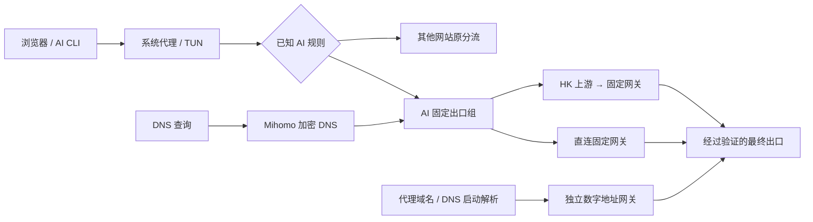

# GoGlobal Infra：出海基础设施与实用内容导航

[内容导航站](https://ipythoning.github.io/goglobal-infra/) · [English](README.en.md) · [中文完整教程](docs/tutorial.zh-CN.md) · [English guide](docs/tutorial.en.md)

GoGlobal Infra 整理可实践、可核验的出海基础设施内容，作为教程与工具的内容导航。第一组专题是 **AI 网络出口与 DNS 隐私**：把已知 AI 流量送到经过验证的固定出口，让 DNS 使用明确的加密代理路径，同时保留其他网站的分流和订阅更新。

第一组专题包含电脑设置、详细 FlClash 操作、分层验收及可由不同智能体读取的配置 Skill，源自一次 macOS / FlClash **0.8.98** 的实际排障，整理日期为 **2026-10-02 UTC**。Windows、Linux 的相关注意事项有官方来源，但没有在本次案例中实机验收。这里不会把一次 IP 查询、节点名称或第三方评分当成住宅属性、全流量一致或账号安全的证明。

## 从哪里开始

| 目标 | 入口 |
| --- | --- |
| 手工配置电脑和 FlClash | [完整中文教程](docs/tutorial.zh-CN.md) |
| 让有本地权限的智能体协助 | [配置 Skill](skills/flclash-ai-privacy/SKILL.md) |
| 理解修改输入和安全边界 | [输入格式](skills/flclash-ai-privacy/references/plan-schema.md) · [智能体工作流](skills/flclash-ai-privacy/references/agent-workflow.md) |
| 准备自己的配置计划 | [占位符模板](skills/flclash-ai-privacy/templates/network-plan.example.json) |

## 链路设计



“直连固定网关”表示不增加 HK 上游，仍然是代理路径。AI 组不加入 `DIRECT`，不在失败时自动切到未验证出口。机场中标为“住宅”的节点先单独测试，符合要求后再加入 AI 组。

## 使用 Skill

支持 Skill 的工具可以安装整个 `skills/flclash-ai-privacy/` 目录。没有 Skill 注册机制的智能体也可以完整读取其中的 `SKILL.md` 和按需引用文件；它仍需要文件、网络和应用权限，文档不会授予权限。

可以给智能体这样的任务：

> 读取本仓的 `skills/flclash-ai-privacy/SKILL.md`。先只审计我明确指定的 FlClash 配置和网络状态，生成可审阅的局部修改计划。保留其他网站分流与原订阅，不停止核心、TUN 或已有连接。凭据只由受信任本地运行时处理，不向对话或公开仓库输出。得到本次修改授权后应用，并分别验证 AI TCP 出口、DNS、WebRTC、IPv6 和订阅。

附带的 Python 助手默认生成审阅结果，只有显式 `--apply` 才修改源配置。它不会自动加载 FlClash，也不会控制网络核心；加载和验收由 Skill 按当前客户端能力完成。

## 公开案例的结论边界

实际案例中，两条 AI TCP 路径验证到了相同固定出口，DNS 扩展检测未再显示当地运营商解析器。机场的“住宅”候选却显示 WARP，WebRTC 也曾显示另一个代理出口；部分旧长连接为保持业务连续性而保留。因此案例没有达到“所有流量统一且住宅属性确认”的完整目标。

教程保留这些限制，教你用证据定位问题。它不修改语言、时区或字体来追逐检测分数，也不提供零封号或零中断承诺。

## 来源与相关链接

原理和格式主要参考 [FlClash](https://github.com/chen08209/FlClash)、[Mihomo 文档](https://wiki.metacubex.one/en/config/)、[ACL4SSR AI 规则](https://github.com/ACL4SSR/ACL4SSR/blob/master/Clash/Ruleset/AI.list)。独立检测参考 [DNSLeakTest](https://dnsleaktest.com/)、[FuckClaude](https://github.com/LinXiaoTao/FuckClaude) 与 [check-cc](https://github.com/yacuo/check-cc)；这些项目与本仓不存在官方联合保证。

项目：[iPythoning/goglobal-infra](https://github.com/iPythoning/goglobal-infra)。相关链接：[shop.paibao.ai](https://shop.paibao.ai)。

公开内容仅含占位符和通用示例，不包含私人订阅、代理凭据、个人公网地址、设备路径或原始配置。

## 维护内容导航站

`site.json` 是站点标题、链接、日期和文章导航的配置来源。修改 Markdown 教程后，重新生成 `docs/` 下的静态 HTML；GitHub Pages 使用 `main` 分支的 `/docs`。

```sh
python3 -m pip install -r requirements.txt
python3 scripts/build_site.py --config site.json
```

本构建只使用公开文档，不读取本机网络配置或凭据。新增文章时，在 `site.json` 中登记实际存在的内容和更新时间；不要伪造验收或发布记录。
