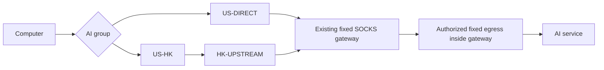

# Advanced Mihomo Troubleshooting: FlClash Egress, DNS and Historical Evidence

[中文](advanced-routing.zh-CN.md) · [Project home](../README.en.md) · [Configuration Skill](../skills/flclash-ai-privacy/SKILL.md)

This page preserves the earlier advanced investigation. First-time users should begin with the [beginner guide](tutorial.en.md). DNS, empty-group handling and chaining here require matching Mihomo capabilities; this is not a generic profile for every core. The later daily policy is Chinese AI/mainland DIRECT, foreign AI residential direct and existing ordinary automatic routing; see the [latest redacted case](../skills/flclash-ai-privacy/references/sanitized-network-case.md). Historical detection scores do not establish suspension probabilities or endorse one-click account-protection tools.

The goal is to send **known overseas AI services through verified fixed egress, use an explicit encrypted proxy path for DNS, and preserve existing routing for other websites**. This guide covers the computer, browser, FlClash, subscription updates, AI CLI tools, and independent checks.

The tested baseline is **macOS and FlClash 0.8.98**. Public sources were checked on **2026-10-02 UTC**. Menus and loading behavior may change between client versions. Windows and Linux notes require their own acceptance checks. The case did not establish that every protocol used the same confirmed residential egress; those limitations remain part of the guide.

## 1. Define acceptance before changing settings

| Layer | Evidence required | What it does not establish |
| --- | --- | --- |
| AI TCP / HTTPS | New connections to each actual AI hostname reach the expected egress | UDP, WebRTC, or IPv6 necessarily uses it |
| DNS | Queries take the intended path, with no observed unauthorized ISP resolvers | Resolver IPs must equal the proxy egress |
| WebRTC | ICE candidates reveal no unapproved public path | No candidates prove all browsers and future sessions are covered |
| IPv6 | The selected policy covers IPv6, or it is unavailable within an explicitly IPv4-only design | `dns.ipv6: false` blocks IPv6 across the operating system |
| Egress classification | Stability, ownership information, and service delivery meet the requirement | A “residential” label or fixed address establishes residential service |
| Account / API | An authorized official client function actually works | A third-party percentage predicts account suspension |

Use independent conditions instead of a single green score. This is a network configuration and privacy diagnostic workflow; it does not require logging into a diagnostic site, submitting account tokens, or altering identity information.

## 2. Gather inputs and record the baseline

Determine the following locally. Keep subscription URLs and credentials in private configuration or a trusted credential system, outside agent conversations, public Issues, and screenshots.

| Input | Source and purpose |
| --- | --- |
| Explicit active profile | Confirm the selected profile in FlClash; do not infer its file from modification time |
| Fixed gateway node | A trusted local runtime reads its existing name, protocol, numeric address, and authentication |
| Expected final egress | Confirm through service authorization and independent connection tests; it may differ from the gateway address |
| Authorized source | Establish which upstream public address the final HTTP / SOCKS service accepts |
| HK candidates | Identify subscription node names, connectivity, and protocol capability |
| Subscription metadata | Preserve the original update toggle, interval, User-Agent, and source |
| Network constraints | Record resolvers, TUN, IPv6, LAN, corporate VPN / Tailscale, and remote sessions |
| Routing scope | AI only or the whole device; this guide assumes AI only |

Record mode, system proxy, TUN, DNS override, automatic connection-closing behavior, and existing long-lived connections before editing. Keep recovery material locally with restricted access. Raw profiles can contain passwords and subscription tokens; do not add them to this public repository.

For an active meeting, remote session, or agent connection over the same proxy, use the already running core and TUN. **Installing TUN for the first time, changing an interface or protocol stack, or restarting a client can affect connectivity. They are not zero-disruption steps.**

## 3. Computer and browser settings

### macOS: inspect first

Inspect resolvers and search domains under System Settings → Network → active service → Details → DNS. Inspect the proxy settings to confirm that FlClash points to the intended local listener. See [Apple’s DNS settings instructions](https://support.apple.com/guide/mac-help/change-dns-settings-on-mac-mh14127/mac).

Do not immediately delete a public DNS address shown by the operating system. TUN may already intercept requests to it; removing it can restore a router or corporate resolver through DHCP. Mihomo documents that macOS and Windows cannot automatically hijack DNS sent to the LAN. Verify the current destination over both UDP and TCP before choosing a change. [Mihomo DNS hijacking](https://wiki.metacubex.one/en/config/inbound/tun/#dns-hijack)

Local inspection commands:

```sh
scutil --dns
scutil --proxy
networksetup -listallnetworkservices
route -n get "${PUBLIC_TEST_IP:?set from your local test plan}"
dig @"${CURRENT_DNS_IP:?set from your local network}" "${TEST_DOMAIN:?set from your test plan}" A
dig +tcp @"${CURRENT_DNS_IP:?set from your local network}" "${TEST_DOMAIN:?set from your test plan}" A
```

Supply the variables from your local configuration. `scutil` may expose internal domains and interface information, so share only a necessary redacted summary. An existing fake-IP configuration may return a synthetic address for a test domain. That supports interception into the corresponding resolution process; encrypted DNS connections and an independent leak test must still verify the next hop.

Preserve LAN and corporate VPN split DNS. Avoid unrelated changes to search domains, excluded routes, and proxy bypass entries. Audit other VPN or filtering software and use actual route evidence when multiple tools coexist.

### Browser DNS: assign responsibility explicitly

This design delegates public-domain encrypted DNS to Mihomo. **Make the proxied DoH path in section 6 work before turning off browser secure DNS.** Turning off secure DNS transfers responsibility; without encrypted upstream DNS, interception, and the intended browser route, it can instead downgrade privacy.

Chrome exposes the setting under Settings → Privacy and security → Security → Use secure DNS. Check Ego and other Chromium browsers separately; a change in Chrome does not prove their setting changed. Google also distinguishes fallback in automatic mode from custom-provider behavior. [Chrome documentation](https://support.google.com/chrome/answer/10468685?co=GENIE.Platform%3DDesktop&hl=en)

Firefox has separate DoH protection levels. If it also delegates resolution to Mihomo, verify its own setting and repeat acceptance checks. A managed browser requires the administrator’s policy process. [Firefox documentation](https://support.mozilla.org/en-US/kb/dns-over-https)

If an automation tool prohibits internal settings pages, the user performs the change and records that evidence. An agent must not bypass the prohibition through another tool. Retain Safe Browsing, certificate verification, and HTTPS protections.

### IPv6 and WebRTC

Measure IPv4 and IPv6 separately. If IPv6 is required, use a proxy and TUN route that support it. The active network in the case already restricted IPv6; this guide does not instruct everyone to disable it on every interface. Interface changes can affect connectivity and need separate evaluation.

WebRTC UDP can take another route. A TCP-only SOCKS node and domain rules do not establish that STUN follows AI egress. If the goal includes prohibiting non-proxied UDP, evaluate a browser-supported `disable_non_proxied_udp` policy and its effect on calls. That is a separate browser change: **it was not configured and accepted as passing in this case**. Check support for the browser and management method, then test candidates and calling behavior.

Do not change real language, timezone, or fonts to chase a diagnostic score.

## 4. Establish the direction of the proxy chain

Assume an existing SOCKS gateway at a numeric address already uses a fixed final egress internally. The names below are illustrative; your local plan supplies actual names.



Distinguish the **connection endpoint, authorized source, and final egress**. If a final HTTP proxy accepts only the gateway’s public address, connecting directly from your computer can fail. Entering through an accessible authorized gateway is the correct path. In this case, the existing SOCKS gateway already returned the fixed final egress, so it was preserved and cloned with an HK upstream.

“Direct” in `US-DIRECT` means direct to the gateway. It is not Clash’s `DIRECT` policy. The cloned gateway node adds `dialer-proxy: HK-UPSTREAM`, giving computer → HK → gateway → final egress. Verify the source authorized by the next endpoint. Do not let the HK group select the cloned node in return, which creates a cycle. [Mihomo dialer-proxy](https://wiki.metacubex.one/en/config/proxies/dialer-proxy/)

If you only have the final HTTP endpoint and no suitable gateway, build a chain through the upstream it actually authorizes. A path without HK exists only when the computer’s public address is also authorized and tested, or another accessible authorized gateway provides it. This case does not imply that any fixed endpoint is directly reachable.

Plain SOCKS5 does not encrypt its transport; HTTPS content retains its own TLS. If gateway authentication and metadata need protection, verify a supported TLS or other encrypted transport. Using DoH for DNS does not establish encryption of the entire proxy chain. [Mihomo SOCKS configuration](https://wiki.metacubex.one/en/config/proxies/socks/)

## 5. Detailed FlClash settings and groups

### 5.1 Work with the running network

Check these items in the installed client. Preserve a compliant existing state instead of repeatedly toggling networking.

| Item | Target for this design | Verification |
| --- | --- | --- |
| Mode | Rule | Rule selected on the dashboard; Global changes non-AI routing |
| System proxy | On | Dashboard and OS proxy state agree |
| Virtual network / TUN | On | Existing TUN works and a public test destination routes through it |
| Automatically close connections | Off | Locate the setting in this version to avoid active connection cleanup on switching |
| Global DNS override | Off | The active profile supplies DNS; avoid competing definitions |
| TUN device, stack, MTU, routes | Preserved | A hot edit must not change these fields and rebuild the interface |

These toggles are not proof by themselves. System proxy settings primarily cover applications that honor them; TUN covers other traffic included by its routes. Verify actual connections and test results.

### 5.2 Identify the source profile

Open Profiles and confirm the active card. Duplicate names may identify different profiles; map the selected card to its actual local identifier. Determine whether subscriptions regenerate it and whether scripts or global overrides modify it.

Preserve existing proxies, other groups, rule ordering, subscription metadata, and credential bytes. Restrict changes to AI groups, explicitly identified AI rules, DNS, and the new provider. Do not replace an entire subscription profile with this guide. Download caches are not a durable editing location.

### 5.3 Give each group a clear role

| Group | Members and role |
| --- | --- |
| `US-DIRECT` | The sole verified fixed gateway without an HK dialer; used for ordinary AI and bootstrap resolution |
| `HK-UPSTREAM` | Tested HK candidates from the original subscription provider |
| `US-HK` | A clone of the same gateway, retaining authentication and adding the HK dialer |
| `AI` | Manual choice between the two verified paths; other candidates require acceptance before admission |

The following shows relationships only; **it is not a complete importable profile**. A trusted local runtime preserves and clones the original gateway entry without reproducing credentials here.

```yaml
proxy-groups:
  - name: US-DIRECT
    type: select
    proxies: ["<existing-fixed-gateway-node>"]
  - name: HK-UPSTREAM
    type: select
    use: ["<original-subscription-provider>"]
    filter: "<HK-filter-from-your-node-names>"
    empty-fallback: REJECT
  - name: US-HK
    type: select
    proxies: ["<gateway-clone-with-HK-dialer>"]
  - name: AI
    type: select
    proxies: [US-DIRECT, US-HK]
```

Add the dialer property to the cloned node:

```yaml
# Preserve the original protocol, address, port, and authentication locally.
name: "<gateway-clone-with-HK-dialer>"
dialer-proxy: HK-UPSTREAM
```

Do not put `DIRECT`, a broad automatic selector, or unverified subscription nodes in the AI root. Explicitly set `empty-fallback: REJECT` for dynamically filtered groups. Check actual members after updates rather than trusting the intended YAML. [Mihomo group fields](https://wiki.metacubex.one/en/config/proxy-groups/)

If an existing general automatic group includes every proxy, exclude the new HK clone so it does not enter unrelated routing automatically. Preserve that group and its original members.

### 5.4 Load the local change

Validate YAML, references, absence of cycles, and absence of unresolved placeholders locally. If there is an authorized safe core-validation command, check compatibility without starting a second core on the same ports.

In the tested **0.8.98** workflow, opening the active profile card’s menu → More → Override and leaving the override page triggered configuration application. Review that version’s [OverwriteView](https://github.com/chen08209/FlClash/blob/v0.8.98/lib/views/profiles/overwrite/overwrite.dart) and [task implementation](https://github.com/chen08209/FlClash/blob/v0.8.98/lib/common/task.dart). This is a version-specific loading path, not a promise about every release.

Check for unsaved edits first. After application, confirm the active profile, groups, core process, and TUN state. Do not stop or restart the core, turn TUN off, or close all connections. A hot application can still recreate provider-related connections; preserving streams reduces deliberate interference but does not guarantee zero disruption.

On Proxies, select `AI → US-DIRECT`. To test the HK chain, first choose a tested member of `HK-UPSTREAM`, then select `AI → US-HK`. A latency test proves reachability to its probe target, not the final egress.

## 6. DNS without bootstrap cycles

DNS serves ordinary websites, resolves proxy-node names, and resolves the names of DNS servers. If ordinary DNS requires HK while the HK node itself needs ordinary DNS to resolve its address, startup becomes circular.

This design gives bootstrap and proxy-name resolution an **independent numeric-address gateway**. It must not depend on the subscription provider or on names that it needs to resolve. Ordinary queries then use the currently selected AI path.

| Setting | Arrangement in this design |
| --- | --- |
| `enable` / `enhanced-mode` | Enable DNS and preserve a working, verified fake-IP configuration |
| `listen` | Preserve the working local listener; do not set OS DNS to a local address without an available standard DNS service |
| `respect-rules` | On, with explicit DNS group selection to avoid accidental broad-rule matches |
| `prefer-h3` | Off; avoid adding an untested UDP / HTTP/3 DNS path |
| `nameserver` | A validated numeric-IP DoH URL with `#AI`, or the URL-encoded real AI group name |
| `default-nameserver` | Numeric-IP DoH with independent `#US-DIRECT` |
| `proxy-server-nameserver` | The same independent path to resolve subscription proxy hostnames |
| `fallback` | Do not add an unverified resolution path |
| DNS policies | Audit policies that bypass the public DNS design; preserve necessary internal split DNS |
| System resolver append | Inspect the client’s effective configuration; do not silently add system DNS to public queries |
| Fake-IP range and exceptions | Preserve working values and LAN exceptions rather than changing the interface |

The form is `https://<verified-DoH-IP>/<provider-path>#AI`. Obtain the numeric address and path from the chosen resolver’s official information and verify its certificate. Do not skip TLS checks. The fragment must match the group name exactly; encode spaces and non-ASCII names. A missing proxy name can be interpreted as another connection selector, so verify the effective configuration. [Mihomo DNS and bootstrap parameters](https://wiki.metacubex.one/en/config/dns/)

Encrypted DNS protects the queries it carries. You still need evidence that the proxy, browser, and OS actually use it. [Cloudflare DoH explanation](https://developers.cloudflare.com/1.1.1.1/encryption/dns-over-https/)

If the fixed gateway requires the subscription to be reachable, it is not an independent bootstrap path. Establish a non-circular authorized resolution path first. If that is unavailable, stop changes that depend on it instead of silently switching to `DIRECT`.

`dns.ipv6: false` concerns AAAA responses. The OS may still have cached addresses, explicit IPv6 connections, or other resolvers, so IPv6 routing requires its own check.

## 7. ACL4SSR rules and subscription updates

### Put AI rules before broad routing

Use the public ACL4SSR [AI.list](https://github.com/ACL4SSR/ACL4SSR/blob/master/Clash/Ruleset/AI.list). It is a text rule list, with provider fields `type: http`, `behavior: classical`, and `format: text`. The local plan supplies its URL, refresh interval, and download proxy.

```yaml
# Relationship only: the local plan supplies provider fields and values.
rules:
  - RULE-SET,ai,AI
  # Existing unrelated rules follow in their original order.
```

Place AI rules before broad Google, overseas, media, `DIRECT`, and `MATCH` rules, while retaining required internal exceptions. Identify existing AI rules before redirecting their target; do not globally replace every old policy name.

Lists cover known hostnames, not all traffic semantically related to AI. Audit the OpenRouter, Windsurf, Codeium, Augment, and self-hosted API-relay hostnames you actually use. Inspect the connected host, matched rule, and selected group. Add necessary local rules. Public lists can include shared service domains and can change scope on refresh; recheck key applications after updates.

### Keep the original subscription as a separate source

Preserve its URL, update toggle, interval, and metadata. A combined profile uses a separate HTTP proxy-provider referencing the same authorized source. A trusted local runtime retrieves the private URL without sending it to the model. Retain the required User-Agent. Provider intervals use seconds; do not copy an application database’s millisecond value unchanged.

Use an independent working gateway for provider downloads, avoiding dependence on nodes that have not yet been downloaded. Confirm the response format and actual cached members. [Mihomo proxy-providers](https://wiki.metacubex.one/en/config/proxy-providers/)

This preserves the original subscription settings and permits the combined profile’s dynamic members to refresh. It does not automatically merge every subscribed rule or script. Check original subscription metadata and combined-provider membership separately.

Put residential candidates in an isolated pending-verification group, initially outside the AI root. Check IPv4 / IPv6 egress, stability, WARP / VPN evidence, appropriate ownership databases, and provider information. Several nodes labeled residential returned WARP IPv6 in the case, so their labels were insufficient for admission.

## 8. Acceptance: collect evidence at every layer

Keep `US-DIRECT` selected throughout one test run. Then repeat key checks with `US-HK` and restore the daily default. Record time, versions, selected groups, test targets, and failures rather than keeping only a successful screenshot.

### 8.1 Egress for each actual AI hostname

Test Claude, ChatGPT, OpenAI API, and other AI hosts you use separately. Use `/cdn-cgi/trace` only on hosts that provide it. Otherwise use an authorized actual connection and its FlClash record; an arbitrary API response is not IP evidence.

```sh
# Read variables from your local test plan; use public, credential-free probes.
curl --fail --show-error --silent --proxy "${LOCAL_PROXY_URL:?set local listener URL}" \
  --noproxy '' "${PUBLIC_TRACE_URL:?set credential-free probe URL}"
```

A CLI may ignore system proxy settings. Check ordinary CLI traffic captured by TUN, explicit local-proxy traffic, and the daily AI client’s actual connections separately. In FlClash Connections, inspect new hostnames, matched rules, and the entire group chain. Report only necessary fields.

For remote gateway resolution, `socks5h` differs from locally resolving `socks5`. A trusted runtime must inject any proxy authentication through a constrained interface or stdin configuration; never put passwords in arguments, output, or shell history.

HTTP or TLS success proves that request. Official account status, quota, and service availability are separate checks, requiring explicit authorization before using account credentials.

### 8.2 Extended DNS checks

Open [DNSLeakTest](https://dnsleaktest.com/) in the browser you actually use, run Extended test, and wait for all rounds. Record resolver addresses, organizations, and time without changing nodes or DNS mid-test.

An unauthorized local ISP resolver calls for investigation of browser DoH, LAN DNS, appended system resolvers, VPNs, and application-specific DNS. Recursive resolvers commonly expose their own addresses; Anycast locations are not necessarily the subscriber’s location. Corroborate results with the effective configuration and connection paths. [DNSLeakTest repair principles](https://dnsleaktest.com/how-to-fix-a-dns-leak.html)

### 8.3 WebRTC and IPv6

Inspect actual ICE candidates with an independent tool such as [BrowserLeaks WebRTC](https://browserleaks.com/webrtc). Check valid IPv4 / IPv6 addresses and candidate types, distinguishing local addresses, mDNS names, proxy addresses, and ISP addresses. Not every candidate is a public route, and not every numeric substring is an IP address.

A public candidate belonging to another subscription egress establishes inconsistent paths: you cannot report that all IPs use the AI gateway. An ISP candidate adds a direct-egress concern. No candidates only supports that browser run, not other applications or later network conditions.

Use an independent IPv6 IP page and local `curl -6` / route checks. For an explicitly IPv4-only plan, record the unavailable IPv6 path and scope. For IPv6 support, prove the selected route handles it. Absence of AAAA answers is not route acceptance.

### 8.4 Read FuckClaude / check-cc as signals

These open-source projects help organize language, timezone, Intl, fonts, container, and network signals. They are not Anthropic’s official risk model. A web page cannot inspect complete CLI settings, account status, or every network path. A server-side API sees request headers and network context, which differs from browser sampling. [FuckClaude](https://github.com/LinXiaoTao/FuckClaude) · [check-cc](https://github.com/yacuo/check-cc)

In the case, FuckClaude displayed 33 / 100, mainly from language, fonts, and Emoji signals, while the deployed check-cc displayed 91%. The latter’s client had candidate-IP parsing and data-merging issues, while different services could sample different egress. A causal link between Intl-field replacement and a displayed mismatch remains an inference. That number is not a 91% suspension probability. Public-source inspection was pinned to [check-cc revision 078e7baa](https://github.com/yacuo/check-cc/tree/078e7baa), with the deployed client inspected through [its public script at that time](https://checkcc.org/_next/static/chunks/1hz158h1zwy8v.js). Public source cannot establish the logic of unpublished deployed APIs or backend services. Record time, revision, signal meanings, and source/deployment differences.

Do not install an unknown one-click repair program just to reproduce checks. Do not submit account cookies, API keys, conversations, or subscription authentication to a diagnostic page. Current versions may contact IP-intelligence services, STUN, or third-party resources; review them rather than treating “local detection” in a README as proof of no network activity.

### 8.5 Classification, stability, and existing streams

Repeated observations support fixed egress over that period. Residential classification needs service information and suitable ownership evidence. Databases may disagree, and `Corporate / Business` is not a final verdict by itself. Record sources and dates, and use “unconfirmed” when evidence is incomplete.

Intermittent TLS failures remain unresolved failures. Compare DNS paths, remote resolution, upstream selection, effective settings, and new connections. Do not hide the cause by pinning CDN IPs or disabling certificate checks.

Established AI streams can retain their previous egress. With automatic cleanup off, wait for natural reconnects or let the user reconnect the affected application at an acceptable time. You cannot promise both untouched existing connections and immediate replacement of every current path.

## 9. Troubleshooting and recovery

| Symptom | Next check |
| --- | --- |
| HK latency works but AI fails | Authorized source, final gateway, node resolution, and actual chain; a tested HK selection affects new connections |
| Only remote `socks5h` resolution works | Compare local, TUN, DoH, and cached resolution; inspect bootstrap dependencies instead of pinning CDN addresses |
| AI matches Google / a broad overseas group | Ordering or missing hostnames; inspect the actual matched rule |
| YAML changed but behavior did not | Active profile, subscription replacement, DNS override, and version-specific loading |
| Subscription group empty | Download, User-Agent, response format, and filter; retain rejection rather than direct fallback |
| Web IP and STUN IP differ | Separate UDP / WebRTC policy and call testing; TCP acceptance does not remove the difference |
| DNS location differs from egress | Resolver organization, Anycast, and actual path rather than location alone |
| A restart is required under a continuity constraint | Stop restart-dependent actions, explain the client limitation, and schedule a maintenance window |

Use recovery material from the same local patch. Check that the source has not changed through subscriptions or another operator. If it has, create a new merge plan rather than replacing it wholesale with old data. Load through the safe current-version path and check connectivity, previous routing, and subscriptions again.

## 10. Let different agents follow the same workflow

The [Skill](../skills/flclash-ai-privacy/SKILL.md) is a readable Markdown operating protocol. A tool with a Skill registry can install the directory; another agent can read it directly. It requires tools and permissions, does not depend on one model, and does not replace administrator authorization.

Create a **private local plan** from the [template](../skills/flclash-ai-privacy/templates/network-plan.example.json), following the [plan schema](../skills/flclash-ai-privacy/references/plan-schema.md). Profile paths, names, DNS services, rule sources, and intervals come from that plan. Reviewed local runtime code preserves and handles credentials.

Supply `dns.resolver_paths` explicitly and retain confirmed LAN / VPN policies; do not erase existing policies by copying the template's empty values. Private plaintext resolvers are permitted only for local namespaces declared in `local_dns_policy_keys`. Resolve an unclear scope during audit before applying.

```sh
# Set placeholder variables locally; do not store the private plan or receipt here.
python3 "${SKILL_DIR:?set Skill directory}/scripts/profile_patch.py" "${PRIVATE_PLAN:?set private plan path}"
python3 "${SKILL_DIR:?set Skill directory}/scripts/profile_patch.py" "${PRIVATE_PLAN:?set private plan path}" --apply
python3 "${SKILL_DIR:?set Skill directory}/scripts/profile_patch.py" "${PRIVATE_PLAN:?set private plan path}" --rollback
```

The first command writes a safe review summary and local receipt. The second requires authorization for this change and a receipt bound to the source and plan. Rollback is allowed only while the source still equals this patch’s output. The helper writes the source only: **it does not load FlClash, stop a core, or operate network interfaces**. The agent must perform loading and acceptance using section 5 and current-client capability. See the [agent workflow](../skills/flclash-ai-privacy/references/agent-workflow.md).

Example task:

> Read the complete `skills/flclash-ai-privacy/SKILL.md`. Audit my explicitly identified profile and create a reviewable local patch from my private plan. Fix AI egress only; preserve other routing, subscriptions, LAN, and other VPNs. Do not expose credentials, stop the core or TUN, or close existing streams. Report changes and unverified conditions first. When this change is already authorized, apply it and separately check TCP, DNS, WebRTC, IPv6, subscriptions, and retained connections. Do not claim a pass for an untested layer.

An agent without application-control capability provides verified manual steps and waits for operator evidence. It must not invent changed settings. If a tool denies an action, explain the action and reason and honor that boundary.

## 11. Windows and Linux branches

These platforms were not tested in this case; macOS results do not transfer to them.

On Windows, audit interface DNS, system proxy, VPNs, and firewall rules. Mihomo’s `strict-route` can address multi-interface DNS behavior, but can interfere with other virtual networking software. Enabling it is a routing change requiring evaluation. [Mihomo Windows TUN notes](https://wiki.metacubex.one/en/config/inbound/tun/#strict-route)

On Linux, identify the DNS owner among NetworkManager, systemd-resolved, and other managers. Check split DNS and application proxy settings. `auto-redirect` is Linux-specific; do not treat it as a macOS switch or copy firewall-rewriting commands into a live remote session. [Mihomo Linux TUN notes](https://wiki.metacubex.one/en/config/inbound/tun/#auto-redirect)

Repeat the same independent acceptance checks. Under a continuity constraint, prefer existing running entry points; schedule first-time TUN creation or interface changes separately.

## 12. Publication and maintenance

After a client, subscription, rule, browser, or network change, repeat affected checks. Keep recent evidence for key AI new connections, extended DNS, WebRTC, and IPv6, with outstanding failures marked.

Publish general steps, placeholders, and redacted conclusions only. Keep private profiles, subscription URLs, authentication, personal public IPs, internal domains, account pages, and device paths local. Do not market the guide as guaranteed residential service, uniform egress for every flow, or protection from suspension.

Project: [iPythoning/goglobal-infra](https://github.com/iPythoning/goglobal-infra). Related: [shop.paibao.ai](https://shop.paibao.ai). The related link does not change acceptance criteria; purchased nodes still need independent verification.
