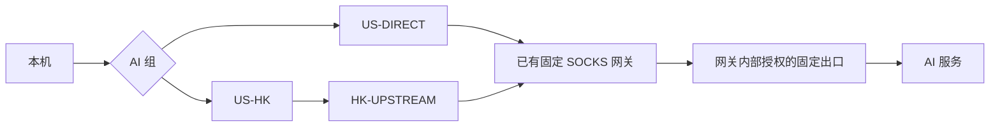

# 从电脑到 AI 服务：FlClash 出口与 DNS 隐私教程

[English](tutorial.en.md) · [返回项目首页](../README.md) · [配置 Skill](../skills/flclash-ai-privacy/SKILL.md)

这份教程的目标是：**已知海外 AI 服务使用经过验证的固定出口，DNS 经明确的加密代理路径解析，其他网站继续按原规则分流。** 它覆盖电脑、浏览器、FlClash、机场订阅、AI CLI 和独立检测。

实机基线是 macOS、FlClash **0.8.98**；公开资料核验日期为 **2026-10-02 UTC**。不同客户端版本可能改变菜单和加载行为。Windows、Linux 小节是需要重新验收的平台分支。本案例没有达到所有协议都使用同一个已确认住宅出口的完整状态，相关限制会在验收部分说明。

先看 Claude 检测结果
目前我的 Claude 防封检测指数：
1.https://ippure.com/claude给我 22 分，仅剩中文字体和 Emoji 渲染风格；
2.https://checkcc.org给到我58%，一路从 84%降下来，我还在等他家的一键防封工具


## 1. 先定义“成功”

| 检查层 | 要证明什么 | 不能由它推出什么 |
| --- | --- | --- |
| AI TCP / HTTPS | 各个实际 AI 域名的新连接到达期望出口 | UDP、WebRTC、IPv6 也一定相同 |
| DNS | 解析请求使用预期路径，没有发现未授权运营商解析器 | DNS 服务器地址必须等于代理出口 |
| WebRTC | ICE 候选没有暴露未经允许的公网路径 | 没有候选就等于所有浏览器、所有时间都无泄漏 |
| IPv6 | IPv6 被所选策略覆盖，或在明确限定的 IPv4 路径中不可用 | `dns.ipv6: false` 已封锁整个系统 IPv6 |
| 出口属性 | 地址稳定、归属及服务供应方式符合要求 | 节点名带“住宅”就是真住宅；固定 IP 就是住宅 IP |
| 账号 / API | 用户授权的官方客户端功能实际可用 | 第三方百分比分数就是封号概率 |

用这些独立条件代替“检测页面全绿”的单一目标。本教程用于合法的网络配置与隐私诊断，不需要登录检测网站、提交账号 Token 或修改身份信息。

## 2. 准备输入，并记录原状态

在本地确定以下信息，订阅和凭据只保存在私人配置或受信任凭据系统中。不要把它们粘贴到智能体对话、公开 Issue 或截图里。

| 输入 | 来源 / 用途 |
| --- | --- |
| 明确的活动配置 | 在 FlClash「配置」确认名称和选择状态；不要凭最近修改时间猜文件 |
| 固定网关节点 | 已有节点的名称、协议、数字地址和认证方式，由本地运行时读取 |
| 期望最终出口 | 从服务授权和独立连接测试确认；网关地址可能与它不同 |
| 授权来源 | 最终 HTTP / SOCKS 服务允许哪个上游公网 IP 连接 |
| HK 上游候选 | 原订阅中的节点名称、连通性和协议能力 |
| 订阅元数据 | 原更新开关、周期、客户端 User-Agent、订阅来源；保留原值 |
| DNS 与网络限制 | 当前系统解析器、TUN、IPv6、LAN、企业 VPN / Tailscale、远程会话 |
| 使用范围 | 仅 AI 固定出口，还是整个设备；本教程默认前者 |

修改前，记录 FlClash 的模式、系统代理、虚拟网卡、DNS 覆写、自动关闭连接状态，以及旧长连接数量。保留本地受限访问的恢复资料；原始配置可能含密码和订阅 Token，不能进入这个公共仓库。

如果正在开会、远程操作或通过同一代理与智能体通信，先使用已经运行的核心和 TUN。**首次安装 TUN、改变网卡、改协议栈或重启客户端都可能影响连通性，不能把它们包装成无中断步骤。**

## 3. 电脑与浏览器设置

### macOS：先检查，再决定是否修改

打开「系统设置 → 网络 → 当前网络服务 → 详细信息 → DNS」检查解析器和搜索域；代理选项检查 FlClash 是否已指向本机监听地址。菜单位置参考 [Apple DNS 设置说明](https://support.apple.com/guide/mac-help/change-dns-settings-on-mac-mh14127/mac)。

不要看到系统里有公共 DNS 就立即删除。TUN 可能已拦截发往它的请求；删除后 DHCP 可能恢复路由器或公司 DNS。Mihomo 明确说明 macOS / Windows 的 TUN 无法自动劫持发往局域网的 DNS，因此必须验证当前目的地址和 UDP / TCP 两种路径，再作决定。[Mihomo TUN 文档](https://wiki.metacubex.one/en/config/inbound/tun/#dns-hijack)

可以在本地终端检查，分享时只输出必要的脱敏摘要：

```sh
scutil --dns
scutil --proxy
networksetup -listallnetworkservices
route -n get "${PUBLIC_TEST_IP:?set from your local test plan}"
dig @"${CURRENT_DNS_IP:?set from your local network}" "${TEST_DOMAIN:?set from your test plan}" A
dig +tcp @"${CURRENT_DNS_IP:?set from your local network}" "${TEST_DOMAIN:?set from your test plan}" A
```

这些变量需要先从你的本地配置取得。`scutil` 输出可能含内部域名和网卡信息，不要整段上传。如果已有 fake-IP，测试域名可能返回配置中的合成地址；这说明请求进入了相应解析流程，仍需用加密 DNS 连接和独立泄漏测试证明后续路径。

保留 LAN 和企业 VPN 的分域解析，避免修改与任务无关的搜索域、排除路由和代理绕过项。先审计浏览器之外的另一套 VPN / 过滤软件；多套工具并存时，以实际路由为准。

### 浏览器 DNS：明确由谁负责

本方案选择 Mihomo 作为公共域名的加密 DNS 管理者。**先使第 6 节的 DoH 代理链路有效，再关闭浏览器自己的安全 DNS。** 这样做是移交解析职责；如果 Mihomo 没有加密上游、TUN 未拦截或浏览器绕过代理，关闭安全 DNS 反而可能降级。

Chrome 的操作为「设置 → 隐私和安全 → 安全 → 使用安全 DNS」。Ego 或其他 Chromium 浏览器需要检查其当前版本的对应设置，不能因为 Chrome 关闭了就假定它也关闭。Google 的说明还区分自动模式和自定义解析器的回退行为。[Chrome 官方说明](https://support.google.com/chrome/answer/10468685?co=GENIE.Platform%3DDesktop&hl=en)

Firefox 有独立的 DoH 保护级别；若同样委托给 Mihomo，应按其设置确认关闭，并重新验收。受企业策略管理的浏览器由管理员处理。[Firefox 官方说明](https://support.mozilla.org/en-US/kb/dns-over-https)

浏览器工具若禁止打开内部设置页，使用者手动完成并记录该证据；智能体不能换一种工具绕过访问禁令。保留安全浏览、证书校验和 HTTPS 保护。

### IPv6 与 WebRTC

先分别测 IPv4 / IPv6 出口。需要 IPv6 的环境应使用能承载它的代理和 TUN 路由。案例中活动网络已有 IPv6 限制，教程不要求把每个网卡一律关闭 IPv6。更改网卡 IPv6 可能影响现有网络，需单独评估。

WebRTC 的 UDP 可以走另一条路径。TCP-only 的 SOCKS 节点和域名分流不能证明 STUN 也会使用 AI 出口。若目标是禁止非代理 UDP，可按浏览器支持的策略评估 `disable_non_proxied_udp`，并检查视频通话影响；这是一项另外的浏览器变更，**本案例没有把它配置并验收为通过**。不同浏览器及托管方式应先核对支持情况，再实测候选和通话。

无需为了降低第三方分数修改真实语言、时区或字体。

## 4. 先弄清代理链的方向

假设已有一个数字地址的 SOCKS 网关，网关内部再使用一个固定出口。使用下列名字只是示意，实际名字由你的配置计划提供。



关键是区分**连接地址、授权来源、最终出口**。若最终 HTTP 代理仅授权网关公网地址，本机直接连接该 HTTP 端点可能被拒绝；从本地能够访问的授权网关进入才是正确路径。案例中已有 SOCKS 网关实际返回固定出口，因此保留它，并克隆一份增加 HK 上游。

`US-DIRECT` 的“直连”是直连这个网关，不是 Clash 的 `DIRECT`。`US-HK` 在网关节点上增加 `dialer-proxy: HK-UPSTREAM`；流量顺序是本机 → HK → 网关 → 最终出口。不要把 HK 写在一个只能授权另一上游的出口上而不核实来源，也不要让 HK 组反过来选择 `US-HK`，否则形成循环。[Mihomo dialer-proxy](https://wiki.metacubex.one/en/config/proxies/dialer-proxy/)

如果你只有最终 HTTP 端点，没有上述可用网关，则必须按该端点实际授权的上游构造链路。只有本机公网地址也获授权且实测可达，才可以提供无 HK 的直接路径。不要从本案例推断任何固定代理都可直拨。

普通 SOCKS5 本身不提供传输加密；HTTPS 内容仍有自己的 TLS。对网关链路的认证和元数据保密有要求时，还需核验节点是否使用受支持的 TLS 或其他加密传输，不能把“DNS 使用 DoH”当成整条代理链都已加密。[Mihomo SOCKS 配置](https://wiki.metacubex.one/en/config/proxies/socks/)

## 5. FlClash 详细设置与分组

### 5.1 使用已运行的网络状态

在 FlClash 仪表盘检查以下项目。已有状态符合要求时保持它；不要反复开关网络。

| 项目 | 本方案的目标状态 | 核对方式 |
| --- | --- | --- |
| 模式 | 规则 | 仪表盘「规则」已选择；全局会改变非 AI 的分流 |
| 系统代理 | 开启 | 仪表盘开关及电脑代理状态一致 |
| 虚拟网卡 / TUN | 开启 | 已有 TUN 正常、公共测试目标路由进入它 |
| 自动关闭连接 | 关闭 | 在当前版本设置中找到该项，防止切换时主动清理连接 |
| 全局 DNS 覆写 | 关闭 | 本方案由活动配置的 DNS 段负责；避免两份设置相互覆盖 |
| TUN 设备、协议栈、MTU、路由 | 保留 | 热修改不改变这些字段，不触发网卡重建 |

这些开关不是独立的“防泄漏证明”。例如系统代理主要供遵循代理设置的应用使用，TUN 用于捕获其他受路由覆盖的流量；最终以连接规则和测试结果为准。

### 5.2 确认源配置，而不是只改缓存

进入「配置」，确认活动卡片。重复名称可能代表不同配置，先在本地对应实际配置标识。确认是否为订阅生成文件、是否会更新覆盖、是否有脚本或全局覆写。

保留原 `proxies`、其他分组、规则顺序、订阅信息以及凭据字节。修改只涉及目标 AI 分组、明确识别的 AI 规则、DNS 和新增 provider。不要直接用本教程替换整个机场配置；下载缓存也不能作为长期修改入口。

### 5.3 创建四个职责明确的组

| 组 | 成员 / 作用 |
| --- | --- |
| `US-DIRECT` | 唯一已验证固定网关，不设置 HK dialer，供日常 AI 和启动解析使用 |
| `HK-UPSTREAM` | 从原订阅 provider 筛选 HK 候选，实测选定一个可用上游 |
| `US-HK` | 克隆相同固定网关，保留认证，增加 `dialer-proxy: HK-UPSTREAM` |
| `AI` | 手动选择 `US-DIRECT` 或 `US-HK`；加入其他候选前必须验收 |

源配置中的关系示意如下；**它是局部结构说明，不是可直接导入的完整配置**。原网关条目由本地受信任运行时保留 / 克隆，不在示例中重建密码。

```yaml
proxy-groups:
  - name: US-DIRECT
    type: select
    proxies: ["<existing-fixed-gateway-node>"]
  - name: HK-UPSTREAM
    type: select
    use: ["<original-subscription-provider>"]
    filter: "<HK-filter-from-your-node-names>"
    empty-fallback: REJECT
  - name: US-HK
    type: select
    proxies: ["<gateway-clone-with-HK-dialer>"]
  - name: AI
    type: select
    proxies: [US-DIRECT, US-HK]
```

克隆节点只新增链路属性：

```yaml
# 原协议、地址、端口与认证保留在本地；下列属性加在克隆节点上
name: "<gateway-clone-with-HK-dialer>"
dialer-proxy: HK-UPSTREAM
```

AI 根组不放 `DIRECT`、全量自动选择或未验证机场节点。动态筛选组显式使用 `empty-fallback: REJECT`，防止筛选为空时出现不符合要求的默认路径。成员变化后检查实际列表，不能只看 YAML 的意图。[Mihomo 分组字段](https://wiki.metacubex.one/en/config/proxy-groups/)

若原通用自动选择组包含所有节点，把新 HK 克隆节点排除，避免它自动进入非 AI 原分流。不要为此删除原组或改变原组既有成员。

### 5.4 加载局部变更

先在本地完成 YAML 解析、节点引用、无循环和无未替换占位符检查；如有已授权安全的核心配置校验入口，再校验兼容性，不启动第二个抢占端口的核心。

在实测 **0.8.98** 中，活动配置卡片「⋮ → 更多 → 覆写」，退出覆写页面可触发配置应用。该版本的退出处理和应用代码可核对 [OverwriteView](https://github.com/chen08209/FlClash/blob/v0.8.98/lib/views/profiles/overwrite/overwrite.dart) 与 [任务实现](https://github.com/chen08209/FlClash/blob/v0.8.98/lib/common/task.dart)。这是版本相关的加载入口，不是所有版本的承诺。

应用前确认没有未保存编辑；应用后核对活动配置、分组、核心进程与 TUN 状态。不要点击停止 / 重启核心，不关闭 TUN，不使用“关闭全部连接”。热应用也可能重建 provider 相关连接，因此保留既有连接只是降低主动干扰，不能保证绝对无中断。

在「代理」中选定 `AI → US-DIRECT`；测试 HK 时先在 `HK-UPSTREAM` 选择实际可用节点，再选 `AI → US-HK`。延迟测试通过只证明测试目标可达，不能替代最终出口验收。

## 6. DNS：解决启动循环与绕路

DNS 至少有三种需求：普通网站解析、解析代理节点域名、解析 DNS 服务器的名字。如果普通 DNS 必须经 HK，而 HK 节点地址又需要普通 DNS 才能获得，就会形成启动循环。

本方案把启动和代理域名解析固定到**独立数字地址网关**。这个组不依赖机场 provider，也不依赖待解析域名；普通查询再经过 `AI` 当前路径。

| 配置项 | 本方案安排 |
| --- | --- |
| `enable` / `enhanced-mode` | 启用 DNS；保留并验收 `fake-ip` 行为 |
| `listen` | 保留已工作的本机监听；不要把系统 DNS 改成没有可用标准 DNS 服务的本机地址 |
| `respect-rules` | 开启；DNS 路径还使用明确组名，避免依赖广泛规则的偶然命中 |
| `prefer-h3` | 关闭；不为 DNS 引入未验收的 UDP / HTTP/3 路径 |
| `nameserver` | 有效的 IP 地址 DoH URL，加 `#AI` 或实际 AI 组名的 URL 编码 |
| `default-nameserver` | IP 地址 DoH URL，加独立 `#US-DIRECT` |
| `proxy-server-nameserver` | 同样使用独立 `#US-DIRECT`，解决机场节点域名 |
| `fallback` | 不加入未经验证的解析路径 |
| `nameserver-policy` 等 | 审计既有策略，排除会绕过公共 DNS 方案的条目；保留必要内网分域 |
| 系统 DNS 追加 | 检查当前客户端有效配置；不能自动把系统解析器混入公共查询 |
| fake-IP 范围与过滤 | 保留原已工作的范围和 LAN 例外，不为本文改网卡 |

DoH URL 形如 `https://<verified-DoH-IP>/<provider-path>#AI`；数值地址和路径取自你选择的官方解析服务，并验证证书。不要跳过 TLS 校验。`#` 后的组名必须与实际配置完全一致，空格和非 ASCII 名称用 URL 编码；不存在的名字可能被解释为网卡等其他含义，应在有效配置中确认。[Mihomo DNS 参数与启动解析](https://wiki.metacubex.one/en/config/dns/)

加密解析只保护其承载的查询路径；还要确认代理、浏览器和系统确实使用它。[Cloudflare DoH 原理](https://developers.cloudflare.com/1.1.1.1/encryption/dns-over-https/)

如果现有网关必须通过机场才能连接，就不能把它当作独立启动路径。先建立不循环且获授权的解析方案，无法满足时停止依赖该方案的修改，而不是静默改成 `DIRECT`。

`dns.ipv6: false` 只影响 AAAA 答复；系统可能仍有缓存、显式 IPv6 连接或其他解析器。IPv6 验收要单独进行。

## 7. ACL4SSR AI 规则与机场更新

### AI 规则要在广泛分流之前

本方案使用 ACL4SSR 的公开 [AI.list](https://github.com/ACL4SSR/ACL4SSR/blob/master/Clash/Ruleset/AI.list)。下载格式是普通规则文本，provider 设置为 `type: http`、`behavior: classical`、`format: text`。URL、更新周期和下载代理放进本地计划，不在 helper 里写死。

```yaml
# 关系示意；路径、周期与 provider 定义由你的本地计划生成
rules:
  - RULE-SET,ai,AI
  # 接着是原配置中其他规则，顺序不变
```

把 AI 规则放在原 Google、海外通用、媒体、`DIRECT` 和 `MATCH` 等更广规则之前；保留必要内网例外。逐条识别既有 AI 规则并改目标组，不对所有旧规则做文本全局替换。

规则列表能覆盖的是已知域名。还需要审计 OpenRouter、Windsurf、Codeium、Augment 等你实际使用的域名和自建 API relay；未知域名不会因“含有 AI 内容”自动识别。检查实际连接的主机、命中规则和分组，并把必要补充放到本地配置。公共列表也可能包含共享服务域名，订阅更新会改变覆盖范围，更新后复验关键应用。

### 把订阅当作独立数据源

保留原机场配置的 URL、自动更新开关、周期和元数据。组合配置通过单独 HTTP `proxy-provider` 引用同一合法来源，URL 由本地运行时取得，不发给模型。保留原客户端需要的 User-Agent，provider 周期使用秒，不误用应用数据库可能采用的毫秒。

provider 下载代理使用独立可用的固定网关，避免“先下载机场节点，才能选下载机场的节点”这种循环。确认订阅响应符合客户端需要的节点格式，并检查缓存里实际出现了预期成员。[Mihomo proxy-provider](https://wiki.metacubex.one/en/config/proxy-providers/)

这会保留原订阅设置，并让组合配置中的动态成员可独立更新；不意味着原订阅里每个规则、脚本都会自动合入组合配置。更新前后分别检查原订阅元数据与组合 provider 成员。

候选可放在独立的“住宅待验证”组中，但暂不连到 AI 根组。先检查 IPv4 / IPv6 出口、稳定性、WARP / VPN 痕迹、归属数据库和服务商说明。案例里几个住宅标签节点返回 WARP IPv6，不能把它们自动加入已验证住宅组。

## 8. 全链路验收：每层留下证据

先固定选择 `US-DIRECT`，测试期间不切组。完成后再切到 `US-HK` 重复关键项目，最后恢复日常默认。记录时间、客户端 / 浏览器版本、选择的组、测试目标和失败次数；不要只保存一次成功截图。

### 8.1 每个实际 AI 域名的 TCP 出口

分别测试 Claude、ChatGPT、OpenAI API 及自己使用的其他 AI 主机。`/cdn-cgi/trace` 只在提供此入口的主机上使用；不可用时用获授权的实际连接和 FlClash 连接记录，不把任意 API 响应当作 IP 证明。

```sh
# 变量来自你自己的本地测试计划；只使用无需账号凭据的公共探针
curl --fail --show-error --silent --proxy "${LOCAL_PROXY_URL:?set local listener URL}" \
  --noproxy '' "${PUBLIC_TRACE_URL:?set credential-free probe URL}"
```

CLI 可能不使用系统代理，因此还需分别验证普通 CLI 流量经过 TUN、显式本机代理的流量，以及日常 AI 客户端的实际连接。在 FlClash「连接」查看新连接的域名、命中规则和整条代理组；只报告必要字段。

使用网关的远端 DNS 测试时，`socks5h` 与本地解析的 `socks5` 意义不同。含认证的测试必须由受信任本地运行时通过受限接口或标准输入配置注入，不能把密码放在命令参数、输出或 shell 历史里。

HTTP 成功 / TLS 成功只证明这次网络请求；官方 AI 账号、配额和服务可用性是另一项检查，只有用户明确授权才能使用账号凭据测试。

### 8.2 DNS 扩展检测

在你实际使用的浏览器中打开 [DNSLeakTest](https://dnsleaktest.com/)，运行 Extended test 并等全部轮次结束。记录 resolver 地址、组织和测试时间，测试期间不要改节点或 DNS。

出现未授权本地 ISP 解析器时调查浏览器 DoH、LAN DNS、系统附加解析器、VPN 与应用自带 DNS。Cloudflare 等递归解析器通常显示自己的地址，可能使用 Anycast；城市不等于你真实 ISP 位置。结果需要与有效 DNS 配置和连接路径相互印证。[DNSLeakTest 的修复原则](https://dnsleaktest.com/how-to-fix-a-dns-leak.html)

### 8.3 WebRTC 与 IPv6

使用独立的 [BrowserLeaks WebRTC](https://browserleaks.com/webrtc) 查看 ICE 候选，而不是只接受检测网站的汇总标签。检查合法 IPv4 / IPv6 地址、候选类型以及本地地址、mDNS 名称、代理地址和 ISP 地址的区别。不是每个 ICE 候选都能访问公网，也不是每个字符串里的数字都是 IP。

公网候选若为另一个机场出口，证明路径不一致，不能声称“所有 IP 都是 AI 固定出口”。如果是本机 ISP 地址，另有直出风险。未出现候选只支持该次浏览器测试，不覆盖别的应用或未来网络变化。

IPv6 用独立 IP 页面和本地 `curl -6` / 路由检查；对 IPv4 限定方案，报告 IPv6 不可用及范围，对支持 IPv6 的方案则证明目标仍通过所选出口。不要把 DNS 没有 AAAA 当成路由验收。

### 8.4 FuckClaude / check-cc：拆解信号，不照抄结论

这两个开源项目可以帮助整理浏览器语言、时区、Intl、字体、容器和网络信号，但它们不是 Anthropic 官方风险模型。网页看不到完整的 AI CLI 配置、账号状态或所有网络路径；API 端只见请求头 / 服务端网络信号，也不代表浏览器的完整采样。[FuckClaude](https://github.com/LinXiaoTao/FuckClaude) · [check-cc](https://github.com/yacuo/check-cc)

本案例中，FuckClaude 的浏览器结果为 33 / 100，主要贡献来自语言、字体和 Emoji 信号；check-cc 线上显示 91%。后者的线上脚本存在候选 IP 解析和数据合并问题，且不同服务可能采样到不同出口。Intl 字段覆盖与显示错配之间的因果仍属推断。这个数字不能作为 91% 的封号概率。本次公开代码审查固定到 [check-cc 的 078e7baa 提交](https://github.com/yacuo/check-cc/tree/078e7baa)，线上客户端另参考[当时的公开脚本](https://checkcc.org/_next/static/chunks/1hz158h1zwy8v.js)；公开仓库不能证明未公开线上 API / 后端的逻辑。报告应附检测时间、版本和实际信号，区分源码与部署。

不为验证这些项目安装未知“一键修复”程序，也不向检测页面提交 Claude Cookie、API Key、聊天记录或订阅认证。采样页面可能接触 IP 情报服务、STUN 或第三方资源；使用前审查当前版本，不把 README 的“本地检测”当作无任何网络访问的保证。

### 8.5 住宅属性、稳定性与旧连接

同一地址重复出现支持“这段时间固定”。住宅分类还需要供应商提供的服务信息和适当的归属资料；多个数据库可能不同步，`Corporate / Business` 也不是最终裁决。记录来源和查询日期；分类不明时写“未确认”，不改名为“已验证住宅”。

断续 TLS 失败仍属于未解决问题。比较 DNS 路径、远端解析、选定上游、有效配置和新连接，不通过硬编码 CDN 地址或关闭证书校验掩盖原因。

已建立的 AI 长连接可能保留旧出口。关闭自动清理后，等待应用自然重连，或由使用者在可接受的时间主动重连相关应用。不能同时承诺“旧连接完全不动”和“所有当前流立即改出口”。

## 9. 常见问题与恢复

| 现象 | 下一步 |
| --- | --- |
| HK 延迟通过，但 AI 失败 | 查授权来源、最终网关、节点域名解析和实际链路；换已验证 HK 候选只影响新连接 |
| 只有远端 `socks5h` 解析成功 | 对比本机 / TUN / DoH 解析和缓存，检查启动循环；不要长期固定 CDN IP |
| AI 命中 Google / 通用海外组 | 规则前后顺序或漏域名；检查实际命中而不是仅看分组名 |
| 改 YAML 后设置没变 | 核对活动配置、订阅覆盖、全局 DNS 覆写与本版本的加载入口 |
| 订阅组为空 | 检查下载、User-Agent、格式和筛选；保持拒绝，不回退直出 |
| 网页 IP 与 STUN 不同 | 单独处理 UDP / WebRTC 策略，并复验通话；TCP 出口测试不能消除这个差异 |
| DNS 页面城市与出口不一致 | 检查 resolver 组织、Anycast、实际路径；不能仅按城市判定泄漏 |
| 要求无中断，但只能重启才能生效 | 停止依赖重启的操作，说明版本限制；安排维护窗口后再继续 |

恢复使用同一份局部修改的回滚资料，确认源文件没有被其他人 / 订阅改动后再执行。若已发生并发改动，重新生成合并计划，不能整份覆盖回旧配置。随后用同样的安全加载入口验收连通性、旧分流和订阅。

## 10. 让不同智能体执行同一套流程

本仓 [Skill](../skills/flclash-ai-privacy/SKILL.md) 是可读取的 Markdown 操作协议。需要 Skill 注册的工具可安装整个目录；其他智能体也可直接读取。它要求工具和权限，但不绑定某一种模型，也不会代替系统管理员授权。

从 [计划模板](../skills/flclash-ai-privacy/templates/network-plan.example.json) 创建你自己的**私人本地计划**，按 [输入格式](../skills/flclash-ai-privacy/references/plan-schema.md) 填写。配置路径、节点名、DNS 服务、规则来源、周期都从这份计划取得；凭据由已审查的本地运行时保留和处理。

`dns.resolver_paths` 必须明确填写并保留已确认的 LAN / VPN DNS 策略；不要直接用模板中的空值抹掉现有策略。明文私网解析器只允许用于 `local_dns_policy_keys` 中明确声明的本地域名范围。无法确认范围时，先完成审计再应用。

```sh
# 占位变量由使用者设置；私人计划与回执不放进这个公开仓库
python3 "${SKILL_DIR:?set Skill directory}/scripts/profile_patch.py" "${PRIVATE_PLAN:?set private plan path}"
python3 "${SKILL_DIR:?set Skill directory}/scripts/profile_patch.py" "${PRIVATE_PLAN:?set private plan path}" --apply
python3 "${SKILL_DIR:?set Skill directory}/scripts/profile_patch.py" "${PRIVATE_PLAN:?set private plan path}" --rollback
```

第一条生成安全的审阅摘要及本地回执；第二条需要本次改动已有授权，且回执绑定源文件与计划；第三条只允许源文件仍等于本次产物时恢复。助手只写源配置，**不会加载 FlClash、停止核心或操纵网卡**。实际加载仍由智能体按第 5 节和当前版本能力完成。完整步骤见 [智能体工作流](../skills/flclash-ai-privacy/references/agent-workflow.md)。

可复制给智能体的任务：

> 完整读取本仓 `skills/flclash-ai-privacy/SKILL.md`。审计我明确指定的配置，按私人本地计划创建可审阅的局部补丁。仅 AI 固定出口，保留原分流、订阅、LAN 和其他 VPN。不读取回显凭据，不停止核心、TUN 或已有连接。先报告差异和无法验证项；已有本次修改授权时应用，再分别验证 TCP、DNS、WebRTC、IPv6、订阅和旧连接。无法验证的层写明，不宣称全通过。

对没有应用操作能力的智能体，Skill 应输出已经核对过的手工点击步骤并等待操作者提供证据；不能虚构开关已改。运行权限被工具拒绝时，说明具体动作与原因，遵循限制。

## 11. Windows / Linux 分支

这里没有本次实机数据，不能复用 macOS 的“已通过”结论。

Windows 先审计当前网卡 DNS、系统代理、VPN 与防火墙。Mihomo 的 `strict-route` 可以对多网卡 DNS 行为采取措施，但可能影响其他虚拟化 / 网络软件；启用它是需要评估的路由变更。[Mihomo Windows TUN 说明](https://wiki.metacubex.one/en/config/inbound/tun/#strict-route)

Linux 先确定 NetworkManager / systemd-resolved / 其他管理器中谁管理 DNS，检查 split DNS 和应用代理。`auto-redirect` 是 Linux 专属能力，不要把它当成 macOS 开关；不要复制会重写防火墙的命令到活跃远程会话中。[Mihomo Linux TUN 说明](https://wiki.metacubex.one/en/config/inbound/tun/#auto-redirect)

两种平台都按相同的分层验收标准重新检查，在不中断要求下优先沿用已经运行的入口；第一次创建或改变 TUN 要另外安排。

## 12. 公开与长期维护

每次客户端、订阅、规则、浏览器或网络环境变化后，复验受影响的层。至少保留关键 AI 新连接、DNS 扩展、WebRTC 和 IPv6 的最近一次记录，并标明尚未通过的检查。

分享时只发布通用流程、占位符和经脱敏的结论。私人配置、订阅 URL、认证、个人公网地址、内部域名、账号页面和设备路径都留在本地。公开教程不得包装成“保证住宅 / 全流量一致 / 零封号”。

项目：[iPythoning/goglobal-infra](https://github.com/iPythoning/goglobal-infra)。相关链接：[shop.paibao.ai](https://shop.paibao.ai)。该链接不改变本教程的技术验收标准，购买节点也仍需独立验证。
